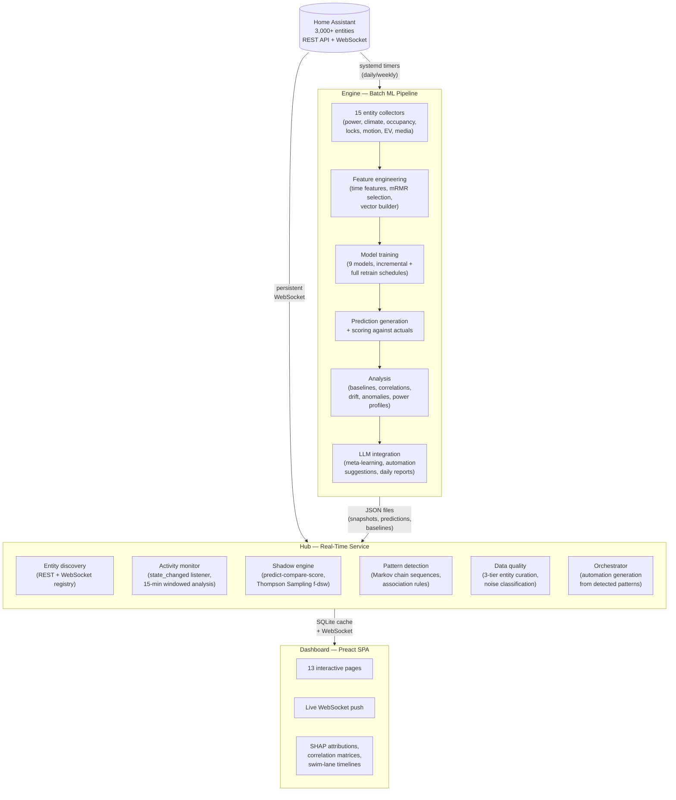
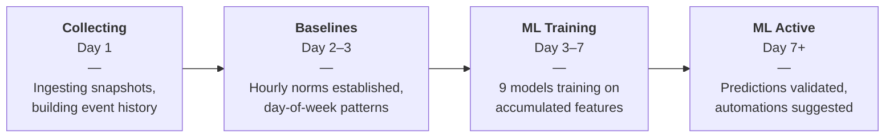
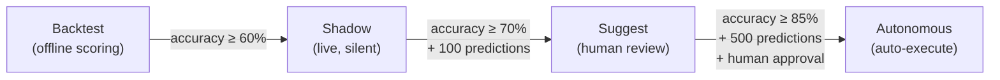

<div align="center">

<pre>
<b>   ████╗    ██████╗    ██╗    ████╗
  ██╔═██╗   ██╔══██╗   ██║   ██╔═██╗
 ██╔╝ ██║   ██████╔╝   ██║  ██╔╝ ██║
 ████████║   ██╔══██╗   ██║  ████████║
 ██╔╝ ╚██║   ██║  ██║   ██║  ██╔╝ ╚██║
 ╚═╝   ╚═╝   ╚═╝  ╚═╝   ╚═╝  ╚═╝   ╚═╝</b>
</pre>

### Adaptive Residence Intelligence Architecture

**Technical Overview for Researchers**

[](https://github.com/parthalon025/ha-aria/actions/workflows/ci.yml)
[](https://github.com/parthalon025/ha-aria/actions)
[](https://www.python.org/)
[](https://opensource.org/licenses/MIT)

[Abstract](#abstract) · [Architecture](#architecture) · [ML Pipeline](#ml-pipeline) · [Models](#models-9) · [Shadow Mode](#shadow-mode) · [Drift Detection](#concept-drift-detection) · [Explainability](#explainability) · [Research Foundations](#research-foundations) · [Cite](#citing-aria)

</div>

---

## Abstract

ARIA (Adaptive Residence Intelligence Architecture) is an open-source, local-first machine learning platform that transforms raw Home Assistant event streams into predictive intelligence. Operating on commodity hardware without cloud dependencies, ARIA processes 22,000+ daily state-change events through a pipeline of 9 ML models, statistical baselines, and LLM-assisted analysis.

The system addresses three open problems in smart home intelligence:

1. **Cold-start learning** — automated progression from raw event ingestion to validated predictions within 7 days, with no manual labeling or configuration
2. **Non-stationary environments** — ensemble concept drift detection (Page-Hinkley + ADWIN + rolling threshold) adapts to changing household behavior without retraining from scratch
3. **Safe autonomous action** — a shadow mode validation layer using Thompson Sampling with frequency-based discounted sliding windows (f-dsw) ensures predictions meet accuracy gates before surfacing automation suggestions

ARIA runs entirely on-premise (tested on Raspberry Pi 4 through multi-core desktops), preserving user privacy while providing research-grade analytics on real-world IoT event streams.

**Keywords:** smart home intelligence, local-first IoT analytics, concept drift detection, Thompson Sampling exploration, Bayesian occupancy estimation, entity correlation, time-series anomaly detection, SHAP explainability, Home Assistant, predictive automation

---

## Architecture

ARIA separates batch learning from real-time monitoring, connected through a shared SQLite cache:



### Data Flow

| Stage | Frequency | Input | Output |
|-------|-----------|-------|--------|
| Snapshot collection | Every 4 hours + adaptive | HA REST API (all entity states) | JSONL snapshot log |
| Baseline computation | Daily | Accumulated snapshots | Day-of-week statistical norms |
| Feature engineering | Daily | Snapshots + baselines | Feature vectors (mRMR-selected) |
| Model training | Weekly (incremental daily) | Feature vectors + labels | 9 trained models |
| Prediction generation | Daily | Latest snapshot + models | Next-day predictions |
| Scoring | Daily | Predictions + actuals | Accuracy metrics, drift signals |
| Activity monitoring | Continuous | WebSocket state_changed | 15-min windows, occupancy, patterns |
| Shadow validation | Continuous | Real-time predictions vs reality | Thompson Sampling arm rewards |

### Learning Progression

ARIA's pipeline advances through four stages without manual intervention:



---

## ML Pipeline

### Feature Engineering

ARIA constructs feature vectors from raw HA state data through three stages:

1. **Entity collection** — 15 specialized collectors extract domain-specific metrics (power consumption in watts, light states, occupancy counts, lock positions, climate setpoints, media playback, etc.)
2. **Time features** — hour-of-day, day-of-week, weekend flag, season, minutes-since-midnight, and cyclical sin/cos encodings
3. **mRMR feature selection** — minimum Redundancy Maximum Relevance (Ding & Peng, 2005) ranks features by mutual information, discarding redundant signals. Runs weekly; top-N features configurable.

### Prediction and Scoring

Predictions target five core metrics: `power_watts`, `lights_on`, `devices_home`, `unavailable_count`, `useful_events`. Each model generates point estimates with confidence intervals. Scoring computes per-metric accuracy using normalized absolute error against day-of-week baselines.

**Cold-start fallback:** When the target day-of-week has insufficient baseline data (< 7 days of history), the predictor falls back to a weighted average across all available day baselines, proportional to sample count per day.

---

## Models (9)

| Model | Type | Training | Purpose | Key Parameters |
|-------|------|----------|---------|----------------|
| **GradientBoosting** | Supervised regression | Weekly full retrain | Primary prediction model | 100 estimators, max_depth=5, learning_rate=0.1 |
| **RandomForest** | Supervised regression | Weekly full retrain | Ensemble diversity, feature importance | 100 estimators, max_depth=10 |
| **LightGBM** | Supervised regression | Daily incremental | Fast incremental updates between full retrains | Incremental via `init_model`, 50 boost rounds |
| **IsolationForest** | Unsupervised anomaly | Weekly full retrain | Global anomaly detection | contamination=0.05, 100 estimators |
| **Hybrid AE+IsolationForest** | Semi-supervised | Weekly | Contextual anomaly detection — autoencoder learns normal, IF scores reconstruction error | 3-layer AE (64→32→64), IF on residuals |
| **Prophet** | Time-series decomposition | Weekly | Seasonal forecasting with holiday effects | Daily seasonality, Bayesian changepoints |
| **NeuralProphet** | Neural time-series | Weekly | Non-linear seasonal patterns | AR-Net with lagged regressors |
| **Markov chains** | Sequence model | Weekly from logbook | Event sequence prediction, anomaly detection | Variable-order (1–3), domain-level transitions |
| **Bayesian occupancy** | Probabilistic fusion | Continuous | Multi-sensor occupancy estimation | Fuses motion, doors, lights, media, person entities |

### Model Registry

Models are managed through a central registry (`aria/engine/models/registry.py`) supporting:
- Versioned storage with rollback
- Training metadata (timestamp, sample count, feature list, hyperparameters)
- Automatic staleness detection (configurable max age)
- Reference model comparison (clean retrain vs incremental for drift validation)

---

## Shadow Mode

Shadow mode implements a **predict-compare-score** loop that validates ARIA's predictions against reality before suggesting automations.

### Thompson Sampling with f-dsw

The shadow engine uses **frequency-based discounted sliding windows** (Cavenaghi et al., 2024) for exploration-exploitation of prediction strategies:

- Each prediction type (next_domain, room_activation, routine_trigger) is an arm
- Rewards are binary (correct/incorrect prediction)
- f-dsw applies exponential discounting to older observations, adapting to non-stationary accuracy
- Arms with insufficient samples get exploration bonus

### Correction Propagation

When predictions are wrong, the system propagates corrections using:
- **Slivkins zooming** (Slivkins, 2014) — hierarchical context similarity for transferring corrections across related contexts
- **Prioritized experience replay** (Schaul et al., 2016) — high-surprise errors are replayed more frequently during shadow evaluation
- **Kernel-weighted propagation** — corrections transfer to similar contexts based on time-of-day, day-of-week, and occupancy similarity

### Pipeline Gate Progression



Gates are configurable. The system can retreat to earlier stages if accuracy drops below thresholds.

---

## Concept Drift Detection

ARIA uses an ensemble of three drift detectors, each sensitive to different types of distribution shift:

| Detector | Reference | Sensitivity | Best For |
|----------|-----------|-------------|----------|
| **Page-Hinkley** | Page (1954), Hinkley (1971) | Gradual drift | Slow seasonal changes (heating patterns shifting as weather changes) |
| **ADWIN** | Bifet & Gavalda, SIAM 2007 | Abrupt + gradual | Sudden behavioral changes (new household member, renovation) |
| **Rolling threshold** | Custom | Sustained degradation | Prediction accuracy dropping below moving baseline |

Drift is detected per-metric. When any detector fires, the system:
1. Flags the metric in the dashboard with detector name and severity
2. Triggers targeted model retraining for affected features
3. Logs the drift event for meta-learning analysis

### ADWIN Implementation

Uses the `river` library's ADWIN implementation with configurable delta (default 0.002). Window size adapts automatically — smaller windows during drift, larger during stable periods.

---

## Explainability

### SHAP Feature Attribution

Every prediction includes SHAP TreeExplainer attributions (Lundberg & Lee, NeurIPS 2017):
- Per-feature contribution to each predicted metric
- Aggregated feature importance rankings across prediction windows
- Visualized as horizontal bar charts in the dashboard (positive/negative contributions)

### LLM Meta-Learning

A local Ollama model (deepseek-r1:8b) performs weekly meta-analysis:
- Reviews prediction accuracy trends across all metrics
- Suggests feature engineering adjustments (add/remove features, change time windows)
- Generates natural-language daily intelligence reports
- Produces automation YAML from detected patterns with confidence scores

The LLM operates in a read-analyze-suggest loop — it never modifies models or configuration directly. All suggestions require human review or shadow mode validation.

---

## Activity Monitor

The real-time activity monitor processes HA WebSocket events through a multi-stage pipeline:

1. **Ingestion** — persistent WebSocket connection receives all `state_changed` events (~22K/day)
2. **Filtering** — 3-tier entity curation (auto-exclude noise domains, edge-case flagging, explicit include/exclude)
3. **Buffering** — events accumulate in 15-minute windows with domain/entity breakdowns
4. **Analytics** — four methods computed per flush:

| Method | Technique | Output |
|--------|-----------|--------|
| Event sequence prediction | Frequency-based 5-gram model | Predicted next domain + probability |
| Activity pattern detection | Frequent 3-domain trigrams | Recurring sequences (3+ occurrences/24h) |
| Arrival prediction | Day-of-week historical averages | Expected next occupancy transition |
| Anomaly detection | Current rate vs hourly historical mean | Flags >2x deviation |

### Occupancy Estimation

Occupancy fuses multiple signal types:
- `person.*` entity states (primary — direct HA tracking)
- `device_tracker.*` transitions (secondary)
- Motion sensor patterns (inferred)
- Door lock/unlock sequences (contextual)

On startup, current occupancy is seeded from the HA REST API to avoid cold-start "away" state when residents are already home.

---

## Entity Curation Pipeline

ARIA's data quality module classifies all HA entities into three tiers:

| Tier | Classification | Criteria | Action |
|------|---------------|----------|--------|
| **Tier 1** | Auto-excluded | Noise domains (update, tts, button, etc.), stale entities (no change in N days), vehicles, entities unavailable beyond configurable grace period | Excluded from all analytics |
| **Tier 2** | Edge cases | Entities that change very infrequently or have unusual patterns | Flagged for review, included by default |
| **Tier 3** | Included | Active, well-behaved entities in tracked domains | Full analytics participation |

Classification runs on startup and daily. Users can override any classification through the dashboard.

---

## Research Foundations

| Technique | Reference | Application in ARIA |
|-----------|-----------|-------------------|
| Page-Hinkley test | Page, E.S. (1954). Continuous inspection schemes. *Biometrika*, 41(1/2), 100–115. | Concept drift detection — gradual shift in prediction error distributions |
| ADWIN | Bifet, A., & Gavalda, R. (2007). Learning from time-changing data with adaptive windowing. *SIAM International Conference on Data Mining*. | Concept drift detection — adaptive window size for abrupt and gradual drift |
| Thompson Sampling (f-dsw) | Cavenaghi, E., et al. (2024). Non-stationary bandits with frequency-based discounted sliding windows. *arXiv:2402.13670*. | Shadow mode exploration — balancing prediction strategy exploration with exploitation |
| Zooming algorithm | Slivkins, A. (2014). Contextual bandits with similarity information. *Journal of the ACM*, 61(1), 1–22. | Correction propagation — transferring prediction corrections across similar contexts |
| Prioritized experience replay | Schaul, T., et al. (2016). Prioritized experience replay. *ICLR 2016*. | Shadow replay buffer — high-surprise errors replayed more frequently |
| SHAP | Lundberg, S.M., & Lee, S.I. (2017). A unified approach to interpreting model predictions. *NeurIPS 2017*. | Feature attribution — per-prediction explanations via TreeExplainer |
| mRMR | Ding, C., & Peng, H. (2005). Minimum redundancy feature selection from microarray gene expression data. *Journal of Bioinformatics and Computational Biology*, 3(02), 185–205. | Feature selection — ranking features by relevance while minimizing redundancy |
| NeuralProphet | Triebe, O., et al. (2021). NeuralProphet: Explainable forecasting at scale. *arXiv:2111.15397*. | Seasonal forecasting — neural network extensions to Prophet decomposition |
| LightGBM | Ke, G., et al. (2017). LightGBM: A highly efficient gradient boosting decision tree. *NeurIPS 2017*. | Incremental gradient boosting — daily model updates without full retrain |
| Isolation Forest | Liu, F.T., Ting, K.M., & Zhou, Z.H. (2008). Isolation Forest. *ICDM 2008*. | Anomaly detection — isolating outliers via random partitioning |
| Autoencoder anomaly detection | Aggarwal, C.C. (2017). *Outlier Analysis* (2nd ed.). Springer. | Hybrid anomaly detection — autoencoder reconstruction error fed to Isolation Forest |

---

## Reproducibility

### Data

ARIA operates on live Home Assistant event streams. For reproducibility:
- Snapshot logs are stored as append-only JSONL (`~/ha-logs/intelligence/snapshot_log.jsonl`)
- Activity windows are persisted in SQLite with timestamps
- Model training metadata includes feature lists, sample counts, and hyperparameters
- All configuration is version-controlled and auditable through the config history table

### Environment

```bash
git clone https://github.com/parthalon025/ha-aria.git
cd ha-aria
python3.12 -m venv .venv
source .venv/bin/activate
pip install -e ".[dev,llm,ml-extra,prophet]"

# Run full test suite (747 tests)
pytest tests/ -v

# Run specific model tests
pytest tests/engine/test_models.py -v
pytest tests/engine/test_predictions.py -v
pytest tests/engine/test_drift.py -v
```

### Project Stats

| | |
|:---|:---|
| **Tests** | 747 passing (CI-enforced on Python 3.12 + 3.13) |
| **Code** | 14,451 lines across 63 Python files |
| **Dashboard** | 44 JSX components across 13 pages |
| **Hub modules** | 8 registered modules |
| **ML models** | 9 (5 supervised, 2 unsupervised, 2 time-series) |
| **Entity collectors** | 15 domain-specific extractors |

---

## Citing ARIA

```bibtex
@software{mcfarland2026aria,
  author = {McFarland, Justin},
  title = {ARIA: Adaptive Residence Intelligence Architecture},
  year = {2026},
  url = {https://github.com/parthalon025/ha-aria},
  note = {ML-powered intelligence for Home Assistant — local-first predictive analytics, anomaly detection, and automation generation}
}
```

**Keywords:** smart home intelligence, home automation ML, local-first IoT analytics, concept drift detection, Thompson Sampling exploration, occupancy prediction, entity correlation, time-series anomaly detection, SHAP explainability, Home Assistant integration, non-stationary bandits, incremental learning, edge computing, Bayesian occupancy estimation

---

## License

[MIT](LICENSE) — Justin McFarland, 2026

*For Home Assistant users: see the [main README](README.md) for installation and usage.*
